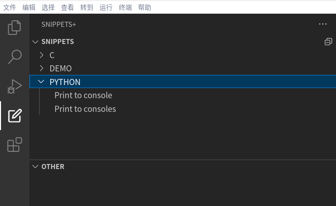

# snippets- README

轻松地创建和修改代码片段。

可以方便的查看、修改 记录的代码片段

基于 vscode snipets 文件， 方便同步

## Features

展示用户自建的 snippets 代码片段

## Release Notes

### 0.0.1
- 0.0.1 初始化完成，新增树视图，展示本地代码条目

## [更新日志](./CHANGELOG.md)